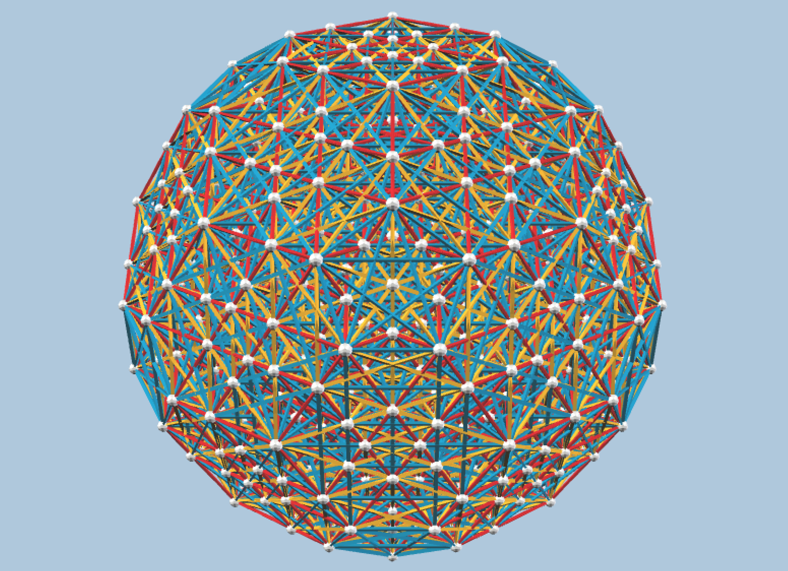

# 1_42 - 3D viewer and preview

**[Open this page on GitHub Pages](https://nanma80.github.io/zomeable-4polytopes/output/gosset_projections/1_42.html)** to view these models.

[Back to Gosset projections index](VIEWER.md).

Strict orthographic zomeable projections of `1_42`.

In the captions, "balls" means distinct 3D ball positions in the vZome model after projection.

<figure style="width: 800px; margin: 5%">
 <vzome-viewer style="width: 100%; height: 500px" src="1_42/1_42_B3_169_balls.vZome" progress="true" >
 </vzome-viewer>
 <figcaption style="text-align: center; font-style: italic;">
    1_42 B3-symmetric projection - 169 balls
 </figcaption>
</figure>

<figure style="width: 800px; margin: 5%">
 <vzome-viewer style="width: 100%; height: 500px" src="1_42/1_42_B3_251_balls.vZome" progress="true" >
 </vzome-viewer>
 <figcaption style="text-align: center; font-style: italic;">
    1_42 B3-symmetric projection - 251 balls
 </figcaption>
</figure>

<figure style="width: 800px; margin: 5%">
 
 <figcaption style="text-align: center; font-style: italic;">
    1_42 H3-symmetric projection - 5936 balls
 </figcaption>
 

    <a href="https://raw.githubusercontent.com/nanma80/zomeable-4polytopes/main/output/gosset_projections/1_42/1_42_H3_5936_balls.vZome" download>
      Click here to download the vZome file and open it from the desktop app.
    </a>
 

</figure>
